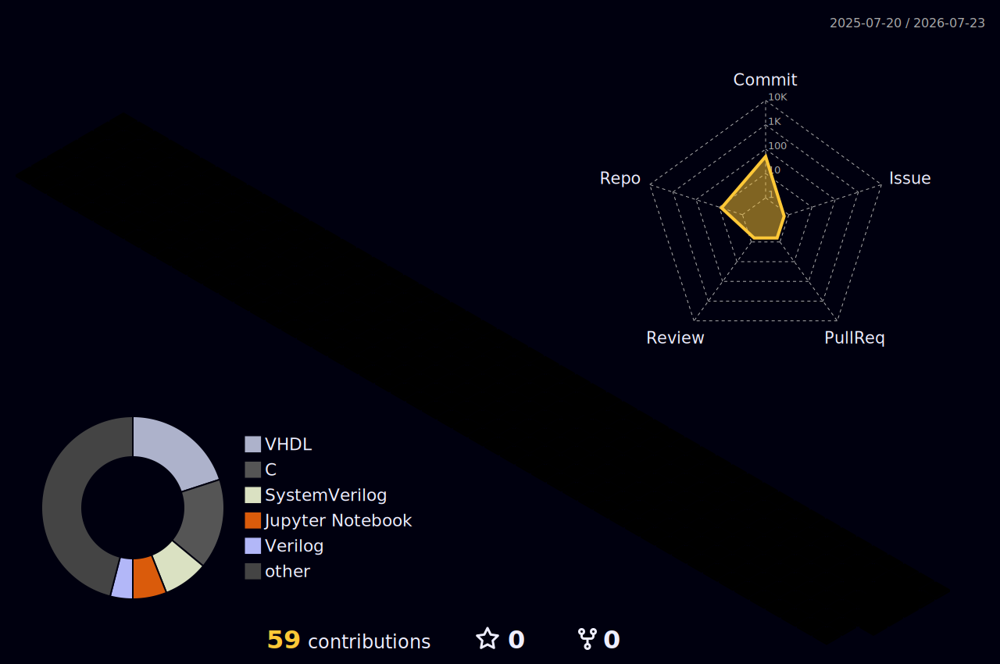

  
  
  **안녕하세요! 제 깃허브를 방문해 주셔서 감사합니다.** 👋
  
  **"꾸준히 답을 찾고, 시스템 타이밍을 개선하는 것을 좋아합니다."**

   

  

---

## 🚀 About Me
- ⚡ **RTL 설계 및 검증**: FPGA 기반 프로세서(RISC-V, MicroBlaze) 및 통신 IP(SPI, I2C, UART) 설계 경험
- 🧠 **On-Device AI 경험**: YOLO 비전 모델 및 LLM 최적화 배포
- 🛠 **하드웨어 검증 학습**: UVM을 활용한 검증 및 Timing/Power 분석

---

## 🛠️ Tech Stack

- **Hardware Design** :  
- **Verification** &nbsp;&nbsp;&nbsp;&nbsp;&nbsp;&nbsp;: 
- **Software & AI** &nbsp;&nbsp;&nbsp;:    
- **Tools** &nbsp;&nbsp;&nbsp;&nbsp;&nbsp;&nbsp;&nbsp;&nbsp;&nbsp;&nbsp;&nbsp;&nbsp;&nbsp;&nbsp;&nbsp;&nbsp;:    
- **Boards** &nbsp;&nbsp;&nbsp;&nbsp;&nbsp;&nbsp;&nbsp;&nbsp;&nbsp;&nbsp;&nbsp;&nbsp;&nbsp;:   

---

## 💻 Key Projects (주요 프로젝트)

| 분야 (Category) | 프로젝트 명 (Project) | 핵심 내용 (Key Details) | 주요 기술 (Tech Stack) |
| :---: | --- | --- | --- |
| **CPU & SoC Architecture** *(하드웨어 설계)* | **[RISC-V 32-bit Multicycle CPU with APB SoC](https://github.com/yunsuhyun-vlog/RISCV-Multicycle)** | - Multi-cycle FSM을 통해 Single-cycle 대비 Dynamic Power 68% 감소. - 타이밍 분석을 통한 Setup Timing(WNS) 개선. | `RISC-V (RV32I)` `Multi-cycle FSM` `APB Protocol` `Memory Mapped I/O` |
| | **[RISC-V RV32I Single-Cycle Processor](https://github.com/yunsuhyun-vlog/RISCV_Single-cycle)** | - Harvard Architecture 기반 CPU 데이터패스와 제어 장치 설계. - C 코드를 활용한 누적 합 연산으로 소프트웨어 동작 검증 완료. | `RISC-V (RV32I)` `Verilog` |
| | **[AXI4-Lite 기반 통신 IP 설계 및 SW 검증](https://github.com/yunsuhyun-vlog/Microblaze_spi)** | - MicroBlaze 코어와 커스텀 SPI IP를 AXI4-Lite 버스로 연동. - Vitis 환경에서 4-Layered SW 아키텍처를 구성하여 동작 검증. | `MicroBlaze` `AXI4-Lite` `Vitis` |
| **Hardware IP & Verification** *(통신 및 검증)* | **[SPI & I2C Protocol Implementation & UVM Verification](https://github.com/yunsuhyun-vlog/SPI_I2C)** | - SPI 및 I2C Master/Slave의 RTL 설계 완료. - UVM 환경에서 검증 시나리오 작성하여 Full-path 검증. | `SPI/I2C` `SystemVerilog` `UVM` |
| | **[UART 기반 센서 및 시계/스톱워치 컨트롤러](https://github.com/yunsuhyun-vlog/UART-Sensor-Stopwatch-Controller)** | - Synchronous FIFO를 활용하여 통신 속도 차이로 인한 병목 현상 개선. - 2-Stage Synchronizer를 통한 비동기 신호의 Metastability 개선. | `UART` `FIFO` `Synchronizer` |
| **On-Device AI & Vision** *(인공지능)* | **[On-Device AI Navigation Guide System](https://github.com/yunsuhyun-vlog/Navigation_Guide)** | - 4개의 YOLO 모델 동시 추론 파이프라인 구축. - 경량 LLM(Qwen2) 교체 및 프롬프트 튜닝으로 지연 시간 3.93초에서 0.94초로 단축. | `YOLO11` `Ollama(Qwen2)` `Multi-threading` `Data Imbalance` |

---

## GitHub

<!-- 이 이미지는 .github/workflows/profile-3d.yml 이 매일 자동 생성해 저장소에 커밋

     테마를 바꾸려면 위 경로의 파일명만 교체하세요:
       profile-night-rainbow.svg      ← 현재 (야경 + 무지개 그라데이션)
       profile-night-view.svg          야경
       profile-night-green.svg         야경 + 초록
       profile-gitblock.svg            블록형
       profile-green.svg  /  profile-green-animate.svg
       profile-season.svg /  profile-season-animate.svg   (북반구 계절색)
     ※ -animate 가 붙은 애니메이션 버전은 green / season 계열
-->

---

Built with SystemVerilog, coffee, and a lot of waveform staring.

